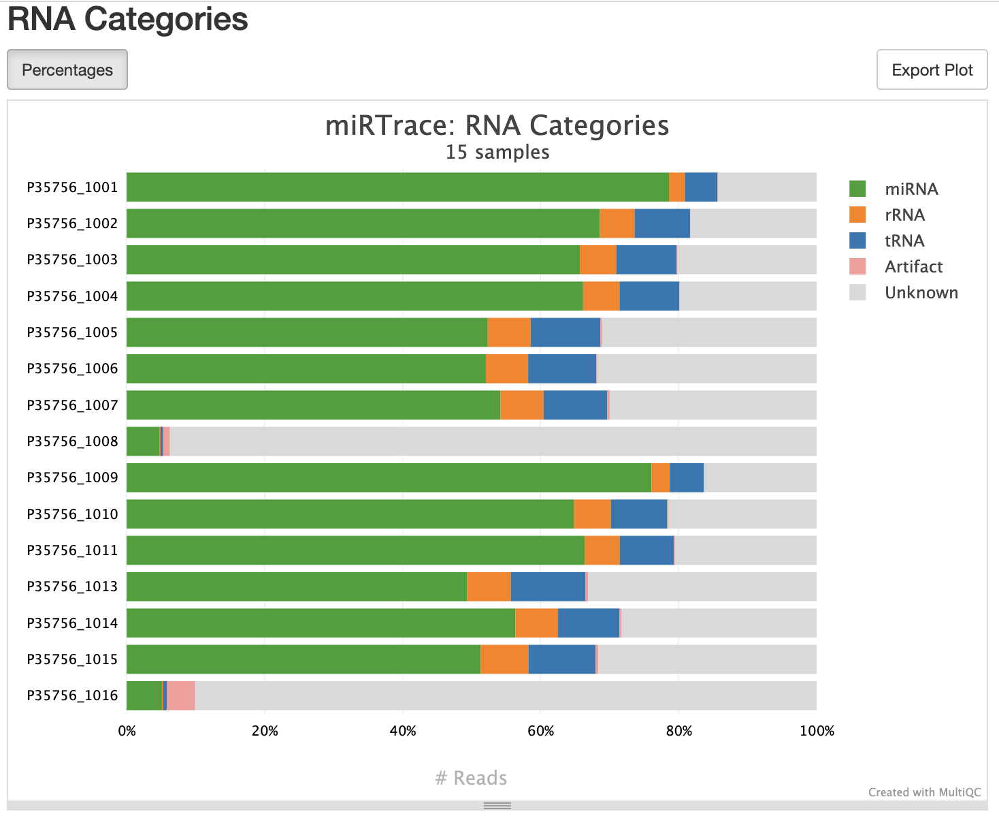
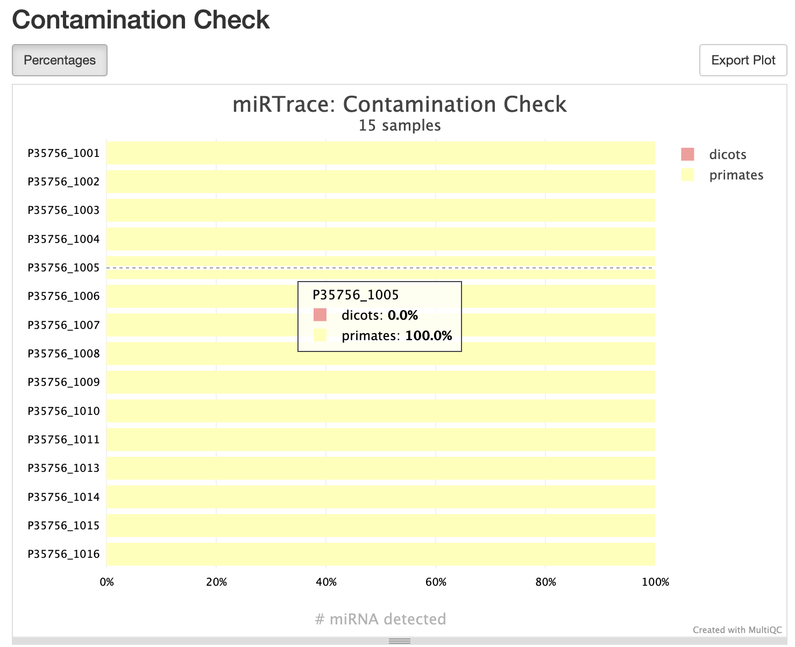

# nf-core/smrnaseq


## 1. Software

### 1.1 Pipeline

| Item       | Value |
|-----------|-------|
| Pipeline  | [nf-core/smrnaseq](https://nf-co.re/smrnaseq/) |
| Version   | 2.4.0 |
| System    | Miarka |
| Deployed  | No (`/proj/ngi2016004/private/remi/opt/nf-core-smrnaseq_2.4.0`) |

> Note: We skip fastp in 2.4.0 due to over-trimming (see issue below).

## 2. Input

#### 2.1 Supported reference genomes

| Species                     | Genome build | miRBase code |
|----------------------------|--------------|--------------|
| Homo sapiens               | GRCh38       | hsa          |
| Mus musculus               | GRCm38       | mmu          |
| Drosophila melanogaster    | dm6          | dme          |

#### 2.2 miRBase data and genome paths

| Item             | Path/Value |
|------------------|------------|
| miRBase root     | `/proj/ngi2016004/private/remi/genomes/miRBase-genomes_v22.1/miRBase/` |
| Mature FASTA     | `CURRENT/mature.fa` (under miRBase root) |
| Hairpin FASTA    | `CURRENT/hairpin.fa` (under miRBase root) |
| miRNA annotation | `hsa.gff3`, `mmu.gff3`, `dme.gff3` (species-specific under miRBase root) |
| Human genome FASTA | `/sw/data/uppnex/igenomes/Homo_sapiens/NCBI/GRCh38/Sequence/WholeGenomeFasta/genome.fa` |

#### 2.3 Example paths (human)

- Mature: `/vulpes/proj/ngis/ngi2016004/private/remi/genomes/miRBase-genomes_v22.1/miRBase/CURRENT/mature.fa`
- Hairpin: `/vulpes/proj/ngis/ngi2016004/private/remi/genomes/miRBase-genomes_v22.1/miRBase/CURRENT/hairpin.fa`
- miRNA GTF/GFF: `/vulpes/proj/ngis/ngi2016004/private/remi/genomes/miRBase-genomes_v22.1/miRBase/hsa.gff3`
- GRCh38 FASTA: `/sw/data/uppnex/igenomes/Homo_sapiens/NCBI/GRCh38/Sequence/WholeGenomeFasta/genome.fa`


## 3. Usage

### 3.1 samplesheet

There currently is no script generate a samplesheet automatically the standard DATA folders. 
It will have to be created manually, e.g.:

```csv
sample,fastq_1,fastq_2
P35756_1001,/path/to/P35756_1001_S1_L001_R1_001.fastq.gz,/path/to/P35756_1001_S1_L001_R2_001.fastq.gz
P35756_1002,/path/to/P35756_1002_S2_L001_R1_001.fastq.gz,/path/to/P35756_1002_S2_L001_R2_001.fastq.gz
...
```

### 3.2 Nextflow run command

```bash
export NXF_SINGULARITY_CACHEDIR=/vulpes/proj/ngis/ngi2016004/private/remi/opt/nf-core-smrnaseq_2.4.0/singularity-images/
nextflow run /vulpes/proj/ngis/ngi2016004/private/remi/opt/nf-core-smrnaseq_2.4.0/2_4_0 \
--input samplesheet.csv \
--outdir ./results \
--project ngi2016004 \
--genome GRCh38 \
--mature /vulpes/proj/ngis/ngi2016004/private/remi/genomes/miRBase-genomes_v22.1/miRBase/CURRENT/mature.fa \
--hairpin /vulpes/proj/ngis/ngi2016004/private/remi/genomes/miRBase-genomes_v22.1/miRBase/CURRENT/hairpin.fa \
--fasta /sw/data/uppnex/igenomes/Homo_sapiens/NCBI/GRCh38/Sequence/WholeGenomeFasta/genome.fa \
--mirtrace_species hsa \
--igenomes_base /sw/data/uppnex/igenomes/ \
--mirna_gtf /vulpes/proj/ngis/ngi2016004/private/remi/genomes/miRBase-genomes_v22.1/miRBase/hsa.gff3 \
--protocol qiaseq \
--with_umi \
--skip_fastp \
--fastp_max_length 70 \
--umitools_extract_method regex \
--umitools_bc_pattern=".+(?P<discard_1>AACTGTAGGCACCATCAAT){s<=2}(?P<umi_1>.{12})(?P<discard_2>.*)" \
-profile singularity \
-c /vulpes/proj/ngis/ngi2016004/private/remi/opt/nf-core-smrnaseq_2.4.0/configs/conf/uppmax.config \
--skip_mirdeep
```

## 4. QC metrics

These are not intended to be hard PASS or FAIL criteria, but rather provide users (and NGI) with feedback about library quality.
The user should be informed about which samples did not meet the described thresholds.

### 4.1 Genome mapping reads

**>95% of reads should map to the target genome**

In the MultiQC report for nf-core/smrnaseq this can be checked in the General Statistics table in the rows called `<sample_name>_mature_hairpin_genome`, column `% mapped`

### 4.2 MirTrace RNA categories

**> 20% of RNA should be annotated as miRNA**

QIAseq is a total RNA prep, so we set this threshold fairly low

And example of the MirTrace -> RNA Categories MultiQC plot for nf-core/smrnaseq. Note that samples "P35756_1008" and "P35756_1016" are negative controls. 

### 4.3 MirTrace contamination

**> 95% of miRNA detected should be assigned to the nearest clade**


Shown is an example of a nf-core/smrnaseq MultiQC report (MirTrace -> Contamination check). This a human miRNA library and the nearest clade as reported by MirTrace should be "primates"

## 5. Notes

### 5.1 Non-default parameters

The pipeline is run with the non-default options:

* `--skip_fastp` -- This is used due a bug where version 2.4.0 over-eagerly trims reads, see: https://github.com/nf-core/smrnaseq/issues/503
* `--skip_mirdeep` -- Skip optional step


### 5.2 Fastp trimming

Skipping fastp trimming makes it harder to rely on average size to determine the miRNA-ness of the sample. E.g. majority of miRNA reads in a sample one would expect an average read length of 22bp after trimming.

### 5.3 Other genomes

AS a rule, any analysis using a genome outside of the ones listed in section 2.2. has to be agreed upon before-hand with the user and the analysis area lead.

## 6. Links


